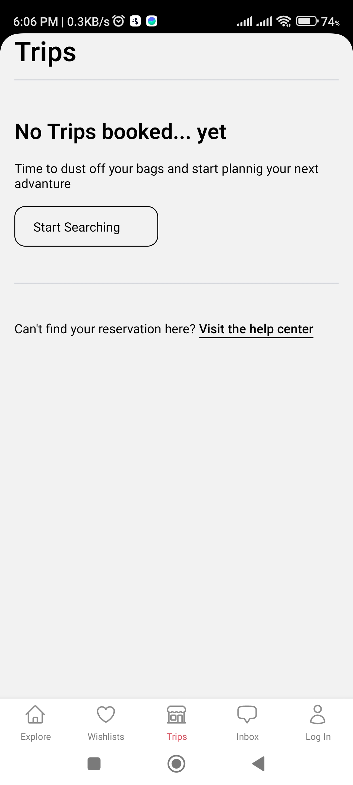

# Airbnb Clone (Mobile Android App)

## Demo

[](https://youtu.be/yJIwHxcDqew)

## Technology

- [React Native](https://reactnative.dev/)
- [NativeWind](https://www.nativewind.dev/)
- [React Navigation](https://reactnavigation.org/)
- [TailwindCss](https://tailwindcss.com/)
- [Redux Toolkit](https://redux-toolkit.js.org/)

### Prerequisites

* [nodejs](https://nodejs.org/en/download/) for install require package with npm
* [androidStudio](https://developer.android.com/studio) require Android SDK and Virtual Mobile (if required)

```bash
npx create-expo-app AwesomeProject
```

#### How to use

Clone GitHub Project on your PC

```bash
git clone https://github.com/nayanrdeveloper/airbnb_clone_react_native
```

```bash
npm install
```

```bash
npx expo start
```

### Screenshots

Home


Wishlist


Trips



Message


Notification


Profile (Log In)


Search Explore


Filter


Place Details


